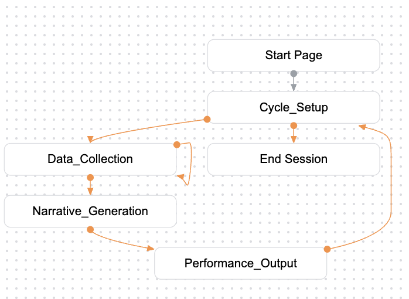

# Overview
The Dialogflow CX flow (`SIR_flow`) is designed to facilitate a structured, interactive, multi-cycle storytelling experience,  based on the tale of **Snow White**. The flow collects words from a user across four parts and uses Gemini 2.5 Flash to dynamically assemble the complete narrative and output accompanying robot performance commands.

The entire system operates as a continuous loop, ensuring a structured progression through the story.

## Core Logic

The flow uses a four-step cycle that repeats for four chapters:

1.  **Cycle Setup**: Initializes the chapter, sets parameters (`current_cycle`, `story_theme`), and checks if the story is complete.
2.  **Data Collection**: Prompts the user for **five specific words** related to the current chapter's script using a Generative AI question generator (`Question_Gen`). The five words are collected before proceeding.
3.  **Narrative Generation**: A Generative AI model (`Story_Gen`) takes the five collected words and plugs them into the corresponding Snow White script (based on the `current_cycle`). This generates the final `story_text` and robot commands (`led_color`, `motion_tag`).
4.  **Performance Output**: Sends the generated story and robot commands (via a custom payload) to the user's platform. It then increments the `current_cycle` and loops back to **Cycle Setup** to begin the next chapter.

## Flow Diagram

The process follows a tight loop controlled by the current story cycle:

